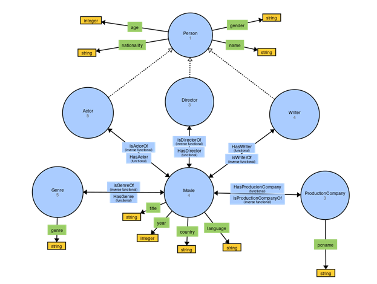
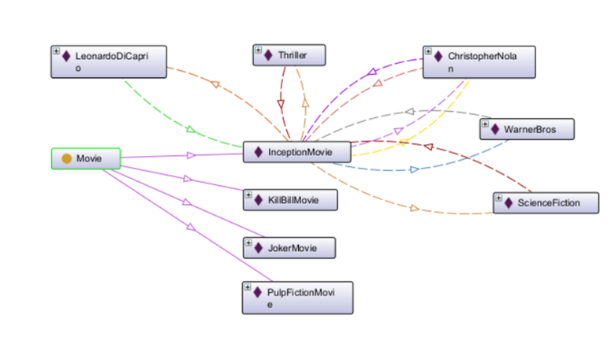
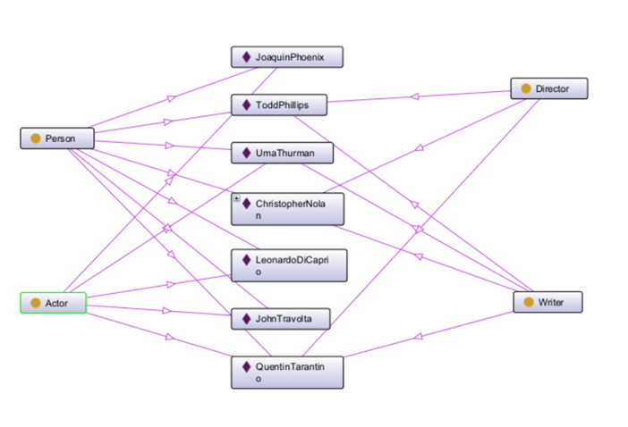
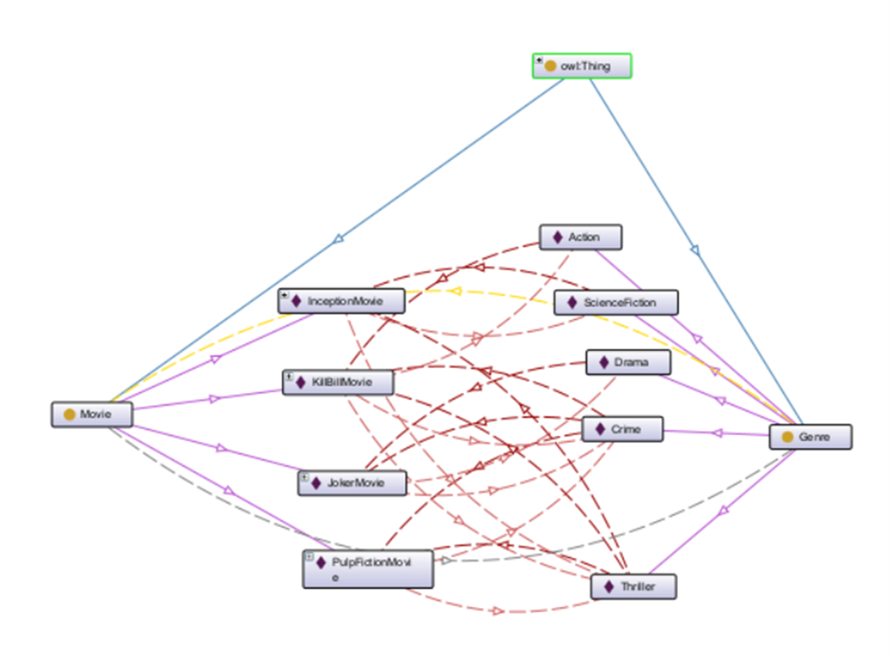
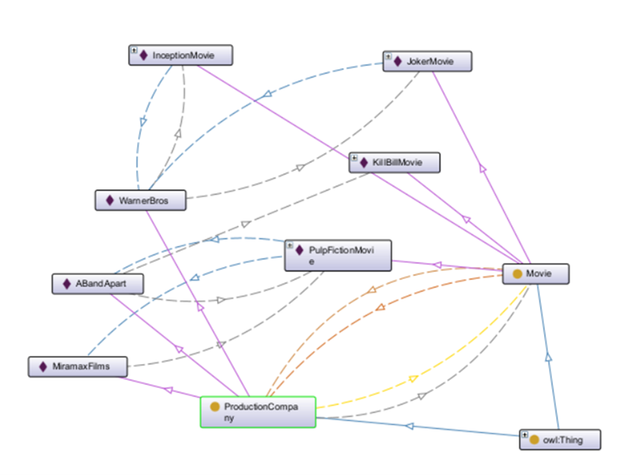
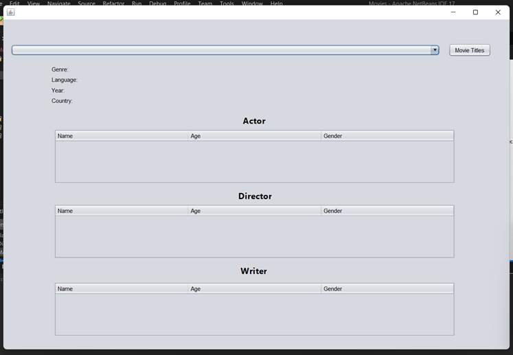
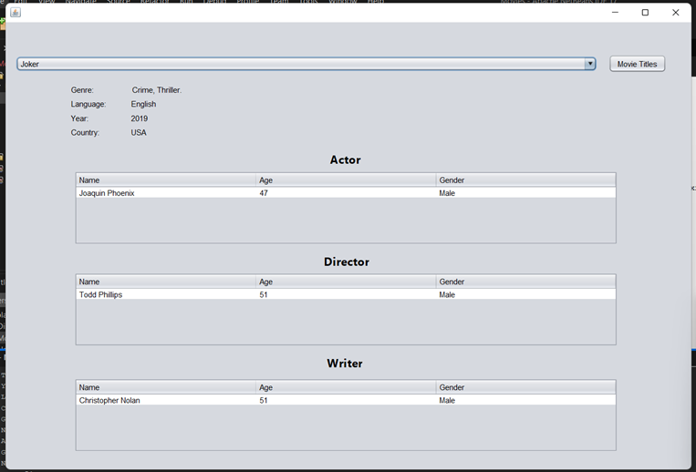

# Movies Ontology
## CSE488 Ontologies and the Semantic Web Project
 
## Classes
The ontology of movies defines the following classes: 

 
* Actor
* Director
* Writer
* Person
* Movie
* Genre
* Production Company

 

An Actor is an individual who plays a role in a movie. 
A Director is an individual who directs a movie. 
A Writer is an individual who writes a script for a movie. 
A Person is an individual who is involved in the movie industry but not necessarily in a specific role. 
A Movie is a film or motion picture. 
A Genre is a category or style of movies, such as action, comedy, drama, etc. 
A ProductionCompany is a company or organization that produces movies. 
## Data Properties
The ontology of movies defines the following data properties: 

* age: The age of a person.
* name: The name of a person.
* gender: The gender of a person.
* nationality: The nationality of a person.
* pcname: The name of a production company.
* country: The country of a movie.
* language: The language of a movie.
* title: The title of a movie.
* year: The year of release of a movie.
* genre: The genre of a movie.
 
## Object Properties
The ontology of movies defines the following object properties: 

HasActor: A movie has an actor.
HasDirector: A movie has a director.
HasWriter: A movie has a writer.
isActorOf: An actor has acted in a movie.
isDirectorOf: A movie is directed by a director.
isWriterOf: A movie is written by a writer.
HasGenre: A movie has a genre.
isGenreOf: A genre belongs to a movie.
HasProductionCompany: A movie is produced by a production company.
isProductionCompanyOf: A production company produces a movie.
## Constraints
The ontology of movies defines the following constraints: 

1. Class Movie, Genre, ProductionCompany, and Person are disjoint classes.
2. Class Actor, Movie, ProductionCompany, and Genre are disjoint classes.
3. Class Director, Movie, ProductionCompany, and Genre are disjoint classes.
4. Class Writer, Movie, ProductionCompany, and Genre are disjoint classes.
5. A movie must have at least one actor (min 1 HasActor).
6. A movie must have exactly one director (exact 1 HasDirector).
7. A movie must have at least one writer (min 1 HasWriter).
8. An actor must have acted in at least one movie (min 1 isActorOf).
9. A director must have directed at least one movie (min 1 isDirectorOf).
10. A writer must have written for at least one movie (min 1 isWriterOf).
11. A movie must have at least one genre (min 1 genre).
12. A genre must have at least one movie (min 1 movie)
13. A movie must be produced by at least one production company (min 1 HasProductionCompany).
14. A production company must have produced at least one movie(min 1 Movie).
15. year some xsd:integer [<= 2023].
16. (gender value "female") or (gender value "male").
17. age some xsd:integer [> 0].
 
## Instances Created:
 
 * Movie Instances. 
    
 * Person Instances.
    
 * Genre Instances.
    
 * Production Company Instances.
    

## Output of the project:
### GUI Output:
 
 

## Team (2) Members:
1. Reda Mohsen Reda 18P5141
2. Zeyad Yasser Abdallah 18P4353
3. Noor Eldin Talaat 18P3826
